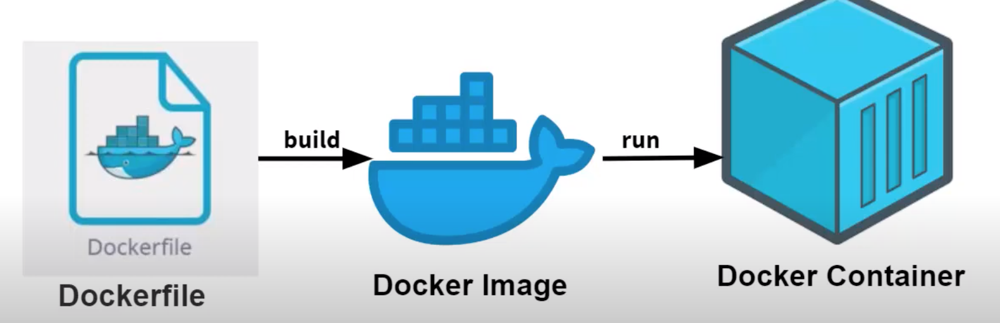

# Self-tutorial Doctorization C++
First, one needs to set up docker. There exists dozen tutorials on this.
Here I'm using [Arch Linux](https://linuxhint.com/arch-linux-docker-tutorial/) as a guide.

## Intro to dockerfile

Docker can build images automatically by reading instruction from docker files.
A docker file is a text document contains all the commands the users may execute on the command line to assemble an image.
One can build a docker file to produce a docker image. Then when we run the docker image, we got the docker container.


We use an example of creating ubuntu image on my machine  (Arch Linux Manjaro)

```
mkdir D1

cd D1

sudo docker images

sudo docker build .

```
Output
```
Fetched 20.1 MB in 4s (5170 kB/s)
Reading package lists...
Removing intermediate container 832ac07c707a
 ---> d18f520fffc5
Step 4/4 : CMD ["bash"]
 ---> Running in a8042974be73
Removing intermediate container a8042974be73
 ---> 72249b244203
Successfully built 72249b244203
```
Run `sudo docker images`, 

```
 REPOSITORY    TAG       IMAGE ID       CREATED         SIZE
<none>        <none>    72249b244203   4 minutes ago   105MB
ubuntu        20.04     ba6acccedd29   2 months ago    72.8MB
hello-world   latest    feb5d9fea6a5   2 months ago    13.3kB
```
Now give the docker image a repository name and tag 

`sudo docker build -t my_app:1 .`

Output
```
Sending build context to Docker daemon  2.048kB
Step 1/4 : ARG VERSION=20.04
Step 2/4 : FROM ubuntu:${VERSION}
 ---> ba6acccedd29
Step 3/4 : RUN apt-get update -y
 ---> Using cache
 ---> d18f520fffc5
Step 4/4 : CMD ["bash"]
 ---> Using cache
 ---> 72249b244203
Successfully built 72249b244203
Successfully tagged my_app:1
```
Run `sudo docker images`,

```
REPOSITORY    TAG       IMAGE ID       CREATED          SIZE
my_app        1         72249b244203   40 minutes ago   105MB
ubuntu        20.04     ba6acccedd29   2 months ago     72.8MB
hello-world   latest    feb5d9fea6a5   2 months ago     13.3kB
```
## Compile C++ on ubuntu docker

### With Clang
There is no official image for clang on dockerhub. One can use the base image we have available in our system. (Ubuntu)
```
sudo docker build . -t clang_cpp:1.0.0

sudo docker run --rm -it clang_cpp:1.0.0

```

### With GCC

There are official image on dockerhub. So
```
sudo docker build . -t gcc_cpp:1
sudo docker run --rm -it gcc_cpp:1
```
